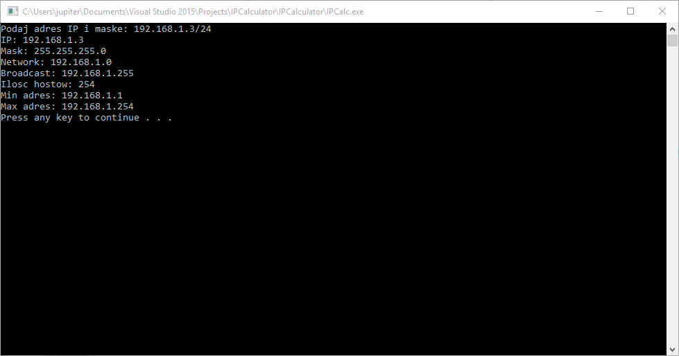
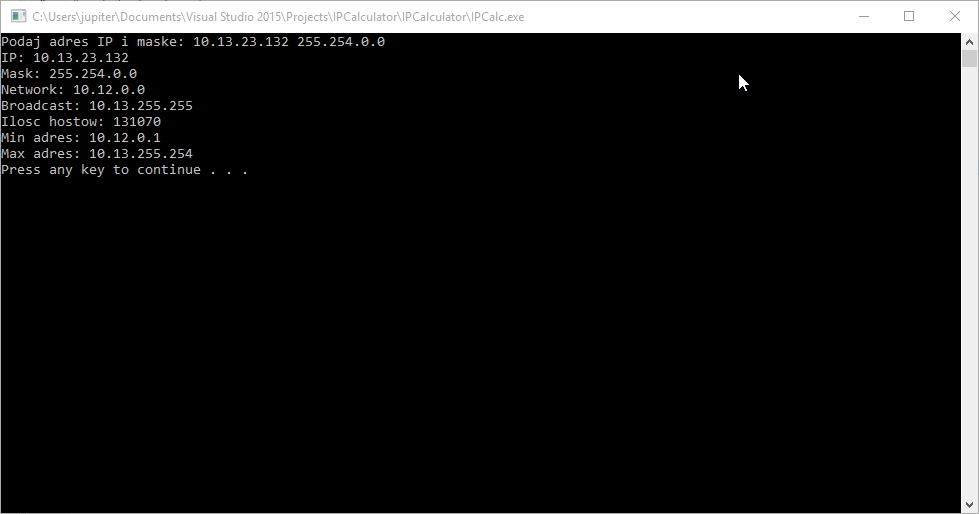

# Kalkulator IP

# Dane wejściowe

## Format cidr

```[adres_ip]/[maska_cidr]``` - ```192.168.1.3/24```

## Format dwa adresy ze spacją

```[adres_ip] [maska]``` - ```192.167.1.23 255.255.254.0```

# Dane wyjściowe 

### Dla notacji za spacją

```
Podaj adres IP i maske: 10.13.23.132 255.254.0.0
IP: 10.13.23.132
Mask: 255.254.0.0
Network: 10.12.0.0
Broadcast: 10.13.255.255
Ilosc hostow: 131070
Min adres: 10.12.0.1
Max adres: 10.13.255.254
```


### Dla notacji cidr

```
Podaj adres IP i maske: 192.156.23.32/25
IP: 192.156.23.32
Mask: 255.255.255.128
Network: 192.156.23.0
Broadcast: 192.156.23.127
Ilosc hostow: 126
Min adres: 192.156.23.1
Max adres: 192.156.23.126
```

# Screenshoty




